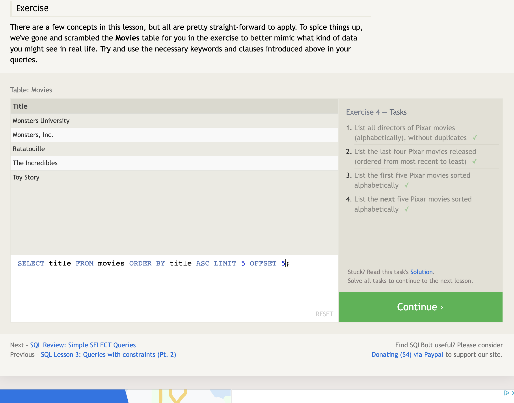

# Understanding Structured Query Language (SQL)

It is generally important to know that SQL is a language dedicated to the structure and manipulation of databases. Databases can be composed of millions (or even BILLIONS!) of rows and columns of information covering an endless array of topics.

SQL uses specific syntax that, in my opinion, models the english language very well in a sense where using SQL simply feels like you're writing actual sentences to tell your database how to operate.

As we progress through the ways SQL works, you will find that there is a consistent structure with how to construct your commands.

Here is a high-level overview of what that looks like:

1. What you are doing
2. What you are targeting
3. How you want to do it
4. Limitations (if any)

Let's get started with a crash course into the world of SQL!

## How to **find** things in your SQL Database

In the below model we have a table in a Database names **Movies**. In this database, from left to right, we have an ID, Title, Director, Year, and Length of movie (in minutes).

What if we want to access onlyy certain parts of this information?

We can use `SELECT * FROM Movies` to display everything in the data base. The asterisk is a wildcard symbol that represents **everything**.

However, what if we just want to return movie titles?
We'd use `SELECT title FROM Movies`. We're telling the database to extract the title data from the movies database.

Need to select multiple rows of data? No problem, let's select the title, director and year the movie was released: `SELECT title, director, year FROM Movies`

Model 1.0 

--- 

## Using conditionals to manipulate data selection

Remember when I mentioned in the introduction about a consistency with the way SQL syntax will become consistent? Here's your first introduction to adding in extra commands. This time I will demonstrate how to use conditional statements to retrieve specific information about the data you wish to see.

We will start off by specificying **What** we want: `SELECT title, year FROM Movies`

Next we will add a conditional that states we only want to see movies that were released between year 2000 and 2010:

`WHERE year >= 2000 AND year <= 2010`

Altogether the command will look like this:

`SELECT title, year`

`FROM movies`

`WHERE year >= 2000 AND year <= 2010`

Model 2.0 

---

## How to find items that are alike

So now we want to access Pixar movies that have the same letters in its name. There are two movies in the database that start with the word "WALL". Here is how we can access just the movies that start with those letters.

`SELECT * FROM Movies`

`WHERE title LIKE "WALL-_"`

In the above commands we access the movie database in the first line and then we give a conditional in the second line that states we only want movies to return that have certain characters in their name.

[Model 3.0]

## How to re-order a selected return

How to we return results in a regular order or reverse order?

We can choose whether we want to return the order in ascending (ASC) or descending (DESC) order. This comes after declaring the database, and what in the database you need. So if we want to return movie titles in Ascending order but limit the selection to just 5 movie titles. Here is how that would look:

`SELECT title FROM Movies`

`ORDER BY title`

`ASC LIMIT 5`

In the above commands we only want to return titles from the movie database. After that we want to ORDER BY title. Meaning to only perform an Order statement on the title listings. The last statement establishes the limit of titles to be shown to be 5.

[Model 4.0]

---

## Put it all together

In this database filled with cities in North America we want to access cities in the United States and order the cities based on population in descending order so it lists the cities with the highest populations first. We want to limit the results to return only two cities and offset the list by two. using offset means it is going to offset the first two options that would show up and skip to the 3rd and 4th options to display instead.

Here's an example:

`SELECT city, population FROM north_american_cities`

`WHERE country LIKE "United States%"`

`ORDER BY population`

`DESC LIMIT 2 OFFSET 2`

Here we selected the cities and population of each city to show from the north american cities database. We only want results to render cities from the United States instead of Mexico and Canada. The list should be in order based on population. The order should be descending and only 2 results to render at a time but offset the results by 2 to bypass the first original two options that would appear.

[Model 5.0]

--- 

## Accessing two separate databases for results

In the next example we will use the command **INNER JOIN** to connect two separate databases to render data regarding move data and the sales to match.
The sales data and the actual movie information are stored in separate databases and here's how the command structure looks:

`SELECT title, domestic_sales, international_sales, rating`

`FROM movies`

`INNER JOIN Boxoffice`

`ON movies.id = Boxoffice.movie_id`

`ORDER BY rating`

`DESC`

Are you starting to see the consistency in which what order the commands are running in? We start by selecting exactly what data we want from each database. Then we join the Boxoffice data with the Movies data. We combine the ids of the movies to correlate to each database and order the movies by their ratings. The order is descending starting with the highest ratings to lowest ratings.

Congratulations! You now understand how to properly access data within your database and how to manipulate the way you want the results to render.
